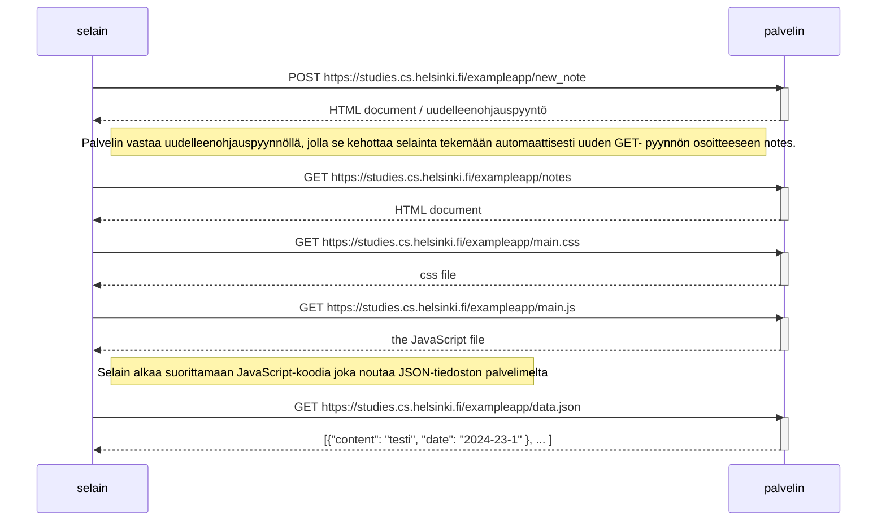

```mermaid
    sequenceDiagram
    participant selain
    participant palvelin

    selain->>palvelin: POST https://studies.cs.helsinki.fi/exampleapp/new_note
    activate palvelin
    palvelin-->>selain: HTML document / uudelleenohjauspyyntö
    deactivate palvelin

    note left of palvelin: Palvelin vastaa uudelleenohjauspyynnöllä, jolla se kehottaa selainta tekemään automaattisesti uuden GET- pyynnön osoitteeseen notes.

    selain->>palvelin: GET https://studies.cs.helsinki.fi/exampleapp/notes
    activate palvelin
    palvelin-->>selain: HTML document
    deactivate palvelin

    selain->>palvelin: GET https://studies.cs.helsinki.fi/exampleapp/main.css
    activate palvelin
    palvelin-->>selain: css file
    deactivate palvelin

    selain->>palvelin: GET https://studies.cs.helsinki.fi/exampleapp/main.js
    activate palvelin
    palvelin-->>selain: the JavaScript file
    deactivate palvelin

    note right of selain: Selain alkaa suorittamaan JavaScript-koodia joka noutaa JSON-tiedoston palvelimelta

    selain->>palvelin: GET https://studies.cs.helsinki.fi/exampleapp/data.json
    activate palvelin
    palvelin-->>selain: [{"content": "testi", "date": "2024-23-1" }, ... ]
    deactivate palvelin 
```