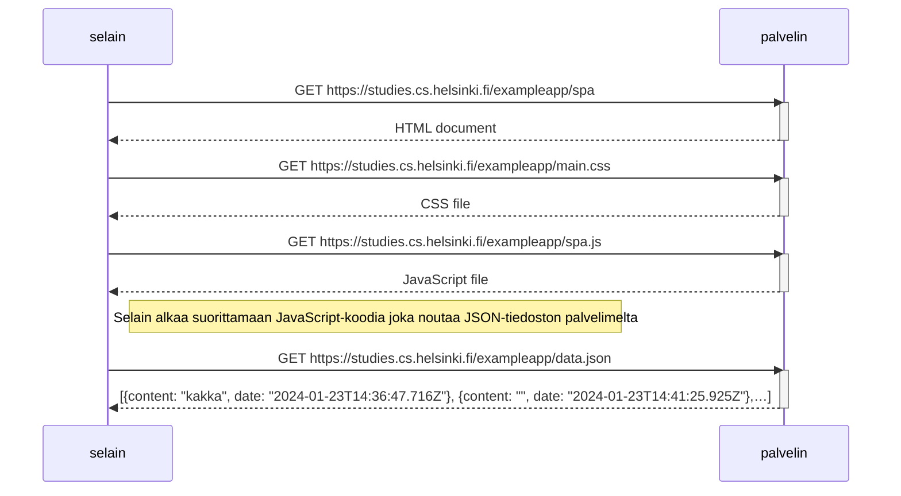

```mermaid
    sequenceDiagram
    participant selain
    participant palvelin

    selain->>palvelin: GET https://studies.cs.helsinki.fi/exampleapp/spa
    activate palvelin
    palvelin-->>selain: HTML document
    deactivate palvelin

    selain->>palvelin: GET https://studies.cs.helsinki.fi/exampleapp/main.css
    activate palvelin
    palvelin-->>selain: CSS file
    deactivate palvelin

    selain->>palvelin: GET https://studies.cs.helsinki.fi/exampleapp/spa.js
    activate palvelin
    palvelin-->>selain: JavaScript file
    deactivate palvelin

    Note right of selain: Selain alkaa suorittamaan JavaScript-koodia joka noutaa JSON-tiedoston palvelimelta

    selain->>palvelin: GET https://studies.cs.helsinki.fi/exampleapp/data.json
    activate palvelin
    palvelin-->>selain: [{content: "kakka", date: "2024-01-23T14:36:47.716Z"}, {content: "", date: "2024-01-23T14:41:25.925Z"},…]
    deactivate palvelin
```